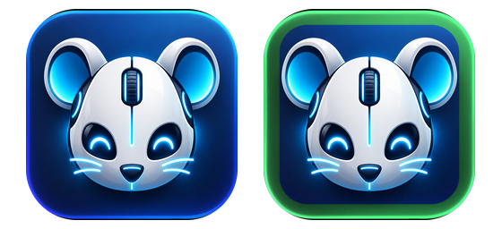

<p align="center">
  
</p>

# RoboMouse

A Windows application that lets you share your mouse and keyboard across multiple computers on the same network. Move your cursor to the edge of one screen and it seamlessly transitions to control another computer.

## Features

- **Seamless Mouse/Keyboard Sharing** - Move your mouse to the screen edge to control another computer
- **Automatic Peer Discovery** - Computers on the same network find each other automatically via UDP broadcast
- **Clipboard Synchronization** - Copy on one machine, paste on another
- **Visual Screen Layout Editor** - Drag and drop to arrange your screens
- **System Tray Application** - Runs quietly in the background; the icon's signal colour shows state (grey = no peers, green = connected, blue = controlling another screen, orange = being controlled)

## Requirements

- Windows 10/11
- .NET 10 Desktop Runtime
- Network connectivity between computers

## Getting Started

### Publishing a Release Build

```bash
dotnet publish src/RoboMouse.App -c Release -r win-x64 --self-contained false -p:PublishSingleFile=true
```

The output in `src/RoboMouse.App/bin/Release/net10.0-windows/win-x64/publish/` needs only the
.NET 10 Desktop Runtime on the target machine.

### Building from Source

```bash
git clone https://github.com/timothydodd/RoboMouse.git
cd RoboMouse
dotnet build
```

### Running

```bash
dotnet run --project src/RoboMouse.App
```

Or build and run the executable directly from `bin/Debug/net10.0-windows/`.

## Usage

1. Run RoboMouse on each computer you want to share
2. Right-click the system tray icon to access the menu
3. Use **Connect to...** to see discovered peers and select their position relative to your screen
4. Move your mouse to the configured edge to start controlling the other computer
5. Move back to the opposite edge to return control to your local machine

### Screen Layout

Use **Screen Layout...** from the tray menu to visually arrange peer screens by dragging them to the desired position relative to your local screen.

### Settings

- **Machine Name** - Friendly name shown to other peers
- **Listen Port** - TCP port for incoming connections (default: 24800)
- **Discovery Port** - UDP port for peer discovery (default: 24801)
- **Clipboard Sharing** - Enable/disable clipboard sync
- **Start with Windows** - Launch automatically on login

## Architecture

```
RoboMouse.sln
├── src/
│   ├── RoboMouse.Core/        # Core library
│   │   ├── Configuration/     # Settings and peer config
│   │   ├── Input/             # Mouse/keyboard hooks and simulation
│   │   ├── Network/           # Peer discovery and connections
│   │   │   └── Protocol/      # Binary message protocol
│   │   └── Screen/            # Screen edge detection
│   └── RoboMouse.App/         # Windows Forms tray application
│       └── Forms/             # Settings and layout forms
└── tests/
    └── RoboMouse.Core.Tests/  # Unit tests
```

## Pairing and Security

Every machine has a **pairing code** (Settings > Network). RoboMouse generates one on first
run; enter the same code on each machine you want to link. Connections are authenticated
against the code and all traffic is encrypted (ECDH key exchange authenticated with the
pairing code, AES-256-GCM per frame). A machine with a different code cannot connect, and
nobody on the network can read or inject input.

The code is stored in plain text in `%AppData%\RoboMouse\settings.json`, so protect that
file as you would a password. Use **New** in Settings to rotate it; other machines then need
the new code.

## Network Protocol

RoboMouse uses a custom binary protocol over TCP for low-latency input transmission:

- **Handshake** - Exchange machine info and screen dimensions
- **Mouse Events** - Relative motion in raw hardware counts, clicks, and scroll
- **Keyboard Events** - Key presses with scan codes
- **Clipboard** - Text and file clipboard data
- **Cursor Control** - Enter/leave notifications

Motion is captured on the controlling machine with the Raw Input API and injected on the
controlled machine as relative movement, so the controlled machine applies its own pointer
speed and acceleration exactly as it would for a directly attached mouse. The controlled
machine hands control back when its cursor is pushed through the edge it entered from.
Consecutive motion messages are merged while waiting to send, and a ping every second
measures round-trip time (shown in the Debug Panel).

Peer discovery uses UDP broadcast on the local network.

## Hotkey

The hotkey (default **Ctrl+Alt+M**, Settings > General) is the escape hatch: while you are
controlling another screen it hands control straight back to this machine, even if the
other machine has stopped responding. Otherwise it turns sharing on or off.

## Known Limitations

- **Elevated windows.** Windows does not let a normal process send input to programs running
  as administrator, or to UAC prompts. Either run RoboMouse as administrator on the controlled
  machine, or move that machine's own mouse for those dialogs.
- **Keyboard layouts.** Keys are forwarded as virtual key codes, so with different layouts on the
  two machines some symbol keys will produce different characters on the remote.
- **Different subnets.** Automatic discovery uses broadcast and never crosses subnets; add such
  peers by IP and make sure the firewall rule on each side allows any remote address
  (Settings > Network > Allow through Windows Firewall).
- **Blank cursor after a crash.** The cursor is hidden by swapping the system cursors while
  controlling. If RoboMouse is killed at that moment, run `RoboMouse.exe --restore-cursor`.

## Firewall Configuration

You may need to allow RoboMouse through your firewall:

- **TCP 24800** - Peer connections
- **UDP 24801** - Peer discovery (broadcast)

## License

MIT License

## Contributing

Contributions are welcome! Please feel free to submit issues and pull requests.
